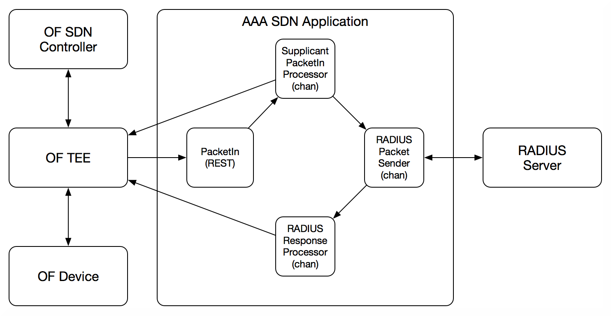

# AAA (EAP - RADIUS) SDN Application based on `OFTEE`
This repository contains a sample application to demonstrate the `OFTEE` SDN
capabilities to externalize an SDN application from any specific SDN
controller.

This application responds to EAPOL request from a supplicant and converts
those into RADIUS requests to a configured RADIUS server. The basic architecture
of the application is depicted below:

Packet processing is done in go routines where channels are used for queuing
of events that need processing and packets that need sent. This allows for
serialization to various sources as that is required in some cases.
